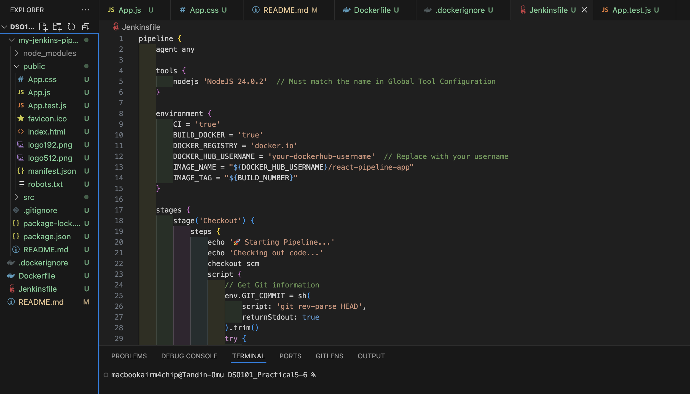

# DSO101_Practical5-6

# Jenkins Declarative Pipeline for React Application

A comprehensive CI/CD pipeline implementation using Jenkins Declarative Pipeline for a React application, featuring automated testing, Docker containerization, and deployment automation.

## Overview

This project demonstrates modern DevOps practices by implementing a complete CI/CD pipeline that:
- Automates the entire software delivery process from code commit to deployment
- Integrates testing, building, and containerization
- Provides secure credential management and deployment strategies
- Follows industry best practices for continuous integration and deployment


## Prerequisites

Jenkins server with Node.js and Git plugins installed
A Node.js project repository (e.g., Express.js, React, or NestJS app)
Basic familiarity with Jenkins and npm/yarn commands

### Jenkins Plugins Required
- NodeJS Plugin
- Docker Plugin
- Docker Pipeline Plugin
- Git Plugin
- Pipeline Plugin
- Blue Ocean (optional, for enhanced UI)

## Installation & Setup

### Phase 1: Environment Setup

#### 1. Create React Application



### Phase 2: Jenkins Configuration

#### 3. Install Jenkins Plugins
1. Navigate to **Manage Jenkins** → **Manage Plugins** → **Available**
2. Install required plugins listed in prerequisites
3. Restart Jenkins after installation

#### 4. Configure Global Tools
1. Go to **Manage Jenkins** → **Global Tool Configuration**
2. Configure Node.js:
   - Name: `NodeJS 24.0.2`
   - Version: Latest stable (20.x or 24.x)
   - ✅ Install automatically
3. Configure Docker (if needed)
4. Save configuration

### Phase 3: Docker Setup

#### 5. Create Dockerfile
```dockerfile
# Multi-stage build for React application
FROM node:20-alpine AS builder
WORKDIR /app
COPY package*.json ./
RUN npm ci --only=production --silent
COPY . .
RUN npm run build

FROM nginx:alpine
COPY --from=builder /app/build /usr/share/nginx/html
EXPOSE 80
HEALTHCHECK --interval=30s --timeout=3s --start-period=5s --retries=3 \
    CMD curl -f http://localhost/ || exit 1
CMD ["nginx", "-g", "daemon off;"]
```

#### 6. Create .dockerignore
```
node_modules
npm-debug.log*
yarn-debug.log*
yarn-error.log*
.git
.gitignore
README.md
.env
coverage
.vscode
.idea
```

### Phase 4: Docker Hub Integration

#### 7. Setup Docker Hub Credentials
1. Create account at [hub.docker.com](https://hub.docker.com)
2. Create repository: `react-pipeline-app`
3. In Jenkins: **Manage Jenkins** → **Manage Credentials**
4. Add credentials:
   - Kind: Username with password
   - ID: `dockerhub-credentials`
   - Username/Password: Your Docker Hub credentials

### Phase 5: Pipeline Creation

#### 8. Create Jenkinsfile
Create a `Jenkinsfile` in your project root with the complete pipeline configuration (see example in repository).

#### 9. Create Jenkins Pipeline Job
1. **New Item** → **Pipeline**
2. Name: `react-pipeline-app`
3. Configure:
   - Pipeline Definition: Pipeline script from SCM
   - SCM: Git
   - Repository URL: Your GitHub repository
   - Script Path: `Jenkinsfile`

## 🔄 Pipeline Stages

### 1. **Checkout** 📥
- Retrieves source code from Git repository
- Extracts branch and commit information
- Sets up workspace environment

### 2. **Environment Info** 🔍
- Displays Node.js and npm versions
- Shows system information
- Validates environment setup

### 3. **Install Dependencies** 📦
- Cleans npm cache
- Installs project dependencies using `npm ci`
- Ensures reproducible builds

### 4. **Code Quality Checks** 🔍
- **Lint**: ESLint code quality analysis
- **Security Audit**: npm security vulnerability scan
- Runs in parallel for efficiency

### 5. **Test** 🧪
- Executes test suite with coverage
- Generates coverage reports
- Publishes HTML coverage reports

### 6. **Build Application** 🏗️
- Creates production React build
- Archives build artifacts
- Validates build integrity

### 7. **Build Docker Image** 🐳
- Creates optimized Docker image
- Tags with build number and latest
- Uses multi-stage build for size optimization

### 8. **Push to Docker Hub** 🚀
- Authenticates with Docker Hub
- Pushes tagged images to registry
- Cleans up local Docker images

### 9. **Deploy** 🎯
- **Development**: Deploys feature branches to dev environment
- **Production**: Deploys main branch to production
- Runs in parallel based on branch conditions

### 10. **Post-Deploy Tests** ✅
- Health checks simulation
- Performance testing validation
- Deployment verification

## 📁 Project Structure

```
my-jenkins-pipeline-app/
├── public/                 # Static assets
│   ├── index.html         # Main HTML template
│   └── favicon.ico        # Application icon
├── src/                   # Source code
│   ├── App.js            # Main React component
│   ├── App.css           # Application styles
│   ├── App.test.js       # Component tests
│   ├── index.js          # Application entry point
│   └── setupTests.js     # Test configuration
├── Jenkinsfile           # CI/CD pipeline definition
├── Dockerfile            # Container configuration
├── .dockerignore         # Docker build exclusions
├── package.json          # Project dependencies
├── .gitignore           # Git exclusions
└── README.md            # Project documentation
```

## 🧪 Testing

### Local Testing
```bash
# Run tests with coverage
npm test -- --coverage --watchAll=false

# Run linting
npm run lint

# Build application
npm run build

# Test Docker build locally
docker build -t test-image .
docker run -p 8080:80 test-image
```

### CI/CD Testing
- Automated test execution in pipeline
- Coverage reporting and archiving
- Build verification and artifact creation
- Docker image testing and deployment

## 🐳 Docker Integration

### Image Build Process
1. **Stage 1 (Builder)**: 
   - Uses Node.js Alpine image
   - Installs dependencies and builds React app
   - Optimizes for build performance

2. **Stage 2 (Production)**:
   - Uses Nginx Alpine for serving
   - Copies built assets from builder stage
   - Includes health checks and security optimizations

### Docker Commands
```bash
# Build image locally
docker build -t your-username/react-pipeline-app .

# Run container
docker run -d -p 8080:80 your-username/react-pipeline-app

# Push to Docker Hub (done automatically by pipeline)
docker push your-username/react-pipeline-app:latest
```

## 🔧 Configuration

### Environment Variables
- `CI=true`: Enables CI mode for testing
- `BUILD_DOCKER=true`: Enables Docker build stages
- `REACT_APP_VERSION`: Application version display
- `REACT_APP_BUILD_TIME`: Build timestamp

### Jenkins Configuration
- Node.js tool: `NodeJS 24.0.2`
- Docker Hub credentials: `dockerhub-credentials`
- SCM polling: Disabled (webhook recommended)
- Build triggers: Manual and webhook-based

## 🚨 Troubleshooting

### Common Issues

#### Node.js Tool Not Found
```bash
# Verify tool configuration in Jenkins
# Ensure name matches exactly: "NodeJS 24.0.2"
```

#### Docker Permission Denied
```bash
# Add jenkins user to docker group
sudo usermod -a -G docker jenkins
sudo systemctl restart jenkins
```

#### Tests Failing in CI
```bash
# Ensure CI environment variable is set
# Use --watchAll=false for non-interactive testing
```

#### Memory Issues
```bash
# Increase Node.js memory limit
export NODE_OPTIONS="--max-old-space-size=4096"
```

### Debug Commands
```bash
# Check Jenkins logs
sudo tail -f /var/log/jenkins/jenkins.log

# Verify Docker installation
docker --version && docker info

# Test pipeline commands locally
npm ci && npm test -- --watchAll=false && npm run build
```

## 📊 Monitoring & Reports

### Available Reports
- **Test Coverage**: HTML coverage reports with detailed metrics
- **Build Artifacts**: Downloadable production builds
- **Pipeline Metrics**: Build duration and success rates
- **Docker Images**: Registry with tagged versions

### Accessing Reports
1. **Coverage Reports**: Available in Jenkins job workspace
2. **Build Artifacts**: Archived in Jenkins for each successful build
3. **Pipeline Visualization**: Use Blue Ocean for enhanced views
4. **Docker Registry**: View images at [hub.docker.com](https://hub.docker.com)

## 🎯 Best Practices Implemented

### Security
- ✅ Secure credential management
- ✅ Non-root Docker containers
- ✅ Dependency vulnerability scanning
- ✅ Environment isolation

### Performance
- ✅ Multi-stage Docker builds
- ✅ Parallel pipeline execution
- ✅ Build artifact caching
- ✅ Resource cleanup automation

### Reliability
- ✅ Comprehensive error handling
- ✅ Automated rollback capabilities
- ✅ Health checks and monitoring
- ✅ Environment-specific deployments

## 🔄 Continuous Improvement

### Potential Enhancements
- [ ] Integration with Kubernetes for orchestration
- [ ] Advanced security scanning (Trivy, Snyk)
- [ ] Performance testing automation
- [ ] Multi-environment promotion workflows
- [ ] Slack/email notification integration
- [ ] Automated dependency updates

## 📚 Learning Resources

- [Jenkins Pipeline Documentation](https://www.jenkins.io/doc/book/pipeline/)
- [Docker Best Practices](https://docs.docker.com/develop/dev-best-practices/)
- [React Testing Guide](https://reactjs.org/docs/testing.html)
- [CI/CD Best Practices](https://docs.github.com/en/actions/guides/about-continuous-integration)

## 🤝 Contributing

1. Fork the repository
2. Create a feature branch: `git checkout -b feature/new-feature`
3. Commit changes: `git commit -am 'Add new feature'`
4. Push to branch: `git push origin feature/new-feature`
5. Submit a Pull Request

## 📄 License

This project is licensed under the MIT License - see the [LICENSE](LICENSE) file for details.

## 👥 Authors

- **Your Name** - *Initial work* - [YourGitHub](https://github.com/yourusername)

## 🙏 Acknowledgments

- React team for the excellent framework
- Jenkins community for powerful CI/CD tools
- Docker for containerization technology
- Open source community for continuous inspiration

---

**Happy Building! 🚀**

For questions or support, please open an issue in this repository.